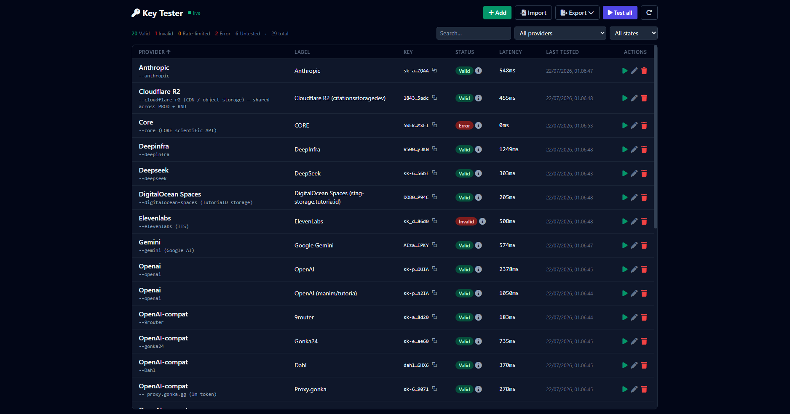

# 🥝 Keyway



A local-first API client — the Postman replacement — with a key vault built in.

The app opens on the **API client**; the vault that started this project is now one of its three tabs.

## Quick start

```bash
bun install           # first time only
bun run dev           # → http://localhost:5174
```

`store.json` is the vault. `keys.md` is a file format you can import from and export to — not a second copy that has to be kept in step.

### Production build (single port)

```bash
bun run build         # vite build → ui/dist
bun start             # → http://127.0.0.1:8788 (serves UI + API)
```

### Docker

```bash
docker compose up -d      # → http://127.0.0.1:8788 (auto-restarts on boot)
docker compose logs -f
docker compose down
```

- **Loopback only.** The port is published on `127.0.0.1` because `store.json` holds real keys and the panel has no auth. For remote access, tunnel port 8788 through the panel in `../port-forward`.
- **Data stays on the host.** The whole project dir is bind-mounted, so `store.json`, `collections.json`, `requests-history.jsonl` and `benchmark/` are the same files you edit locally. Bun runs the TypeScript as-is, so a server code change only needs `docker compose restart` - no rebuild.
- **UI build runs at container start**, but only when `ui/dist` is missing or older than `ui/src` - so an edited UI is picked up by `docker compose restart` too.
- **`node_modules` comes from a named volume** (installed inside the image, masking the host folder). After changing `package.json`:

  ```bash
  docker compose build && docker compose up -d --force-recreate
  docker volume rm key-tester_node_modules   # only if you want a clean reinstall
  ```

- **Env overrides**: `PORT` (8788), `HOST` (keep it on loopback), `TZ`.

## API client

The app opens on the **API client** (the key vault is the second tab). It is the Postman/Apier replacement described in [`docs/api-client-plan.md`](docs/api-client-plan.md):

- **Request tabs** — `Alt+T` new, `Alt+W` close, `Alt+D` duplicate, so testing a GET and a POST no longer means two browser tabs
- **Fixed 3-pane layout** — collections/history sidebar, request, response; the divider is draggable and its position is remembered
- **Bodies** — JSON / text / XML / form-urlencoded / multipart with real file upload (files are picked in the browser and streamed through the server, so nothing is copied into the project)
- **Per-request settings** — timeout, follow-redirects, max redirects, cookie jar on/off
- **Cookie jar** — `Set-Cookie` is captured and replayed, so a login survives across requests
- **Variables** — `{{name}}` from the active environment, plus `{{$uuid}}`, `{{$timestamp}}`, `{{$isoTimestamp}}`, `{{$randomInt}}`
- **History** — the last 14 days of requests (`KEYWAY_HISTORY_DAYS` to change it), grouped by day, each with the time it was sent, its latency and status. Clicking one brings back **the response it produced**, not just the request. Pin an entry to keep it past that window — pinned entries sit in their own group at the top; delete or copy one from the row. `Authorization`-style headers and any vault credential are redacted before anything is written
- **Auth from the vault** — pick a stored key in the Auth tab and the request is signed the way that provider wants it (Bearer, `x-api-key`, Gemini's query param, a freshly minted z.ai JWT). Its non-secret fields come along as variables: `{{vault.baseURL}}`, `{{vault.model}}`
- **Chaining** — reference an earlier response anywhere: `{{res.Login.body.access_token}}`, `{{res.Login.status}}`, `{{res.Search.headers.content-type}}`. Kept in memory for the last 50 requests
- **Import cURL** — `Alt+I` (or the cURL button), paste what devtools gave you; query strings become editable params and unsupported flags are reported, not dropped
- **Scripts** — pre-request and post-response JavaScript in a QuickJS sandbox (no network, no filesystem, 32 MB, 5 s). `req` is mutable, `res` carries `json`, and `bru.getVar/setVar/getEnvVar/setEnvVar` move values between requests. `console.log` output lands in the response pane
- **Tests** — `test('name', () => expect(res.status).toBe(200))` from scripts, plus declarative assertions (source · operator · value) over `status`, `latencyMs`, `size`, `headers.<name>` or a JSON path like `$.data.0.id`. Results show as a pass/fail chip on the response and as `passed/total` in history
- **OAuth 2.0** — client credentials, password, authorization code (PKCE on by default), implicit, refresh token and device code. Tokens are cached, refreshed a minute before they expire, and a request whose flow still needs the browser is refused rather than sent to collect a 401. The redirect URI is `http://127.0.0.1:8788/oauth/callback`
- **Streaming** — `text/event-stream` responses render token by token as they arrive, with **time-to-first-token** and **tokens/second** next to the status. Deltas are understood in OpenAI, Anthropic, Gemini and Ollama shapes
- **Matrix run** — send the current request across several vault keys (and models) at once and compare status, latency, TTFT and answer side by side. The body writes `{{model}}`, the URL writes `{{vault.baseURL}}`, and each cell fills them in from its own key
- **Quota column** — for providers that expose a balance cheaply (OpenRouter, DeepSeek, ElevenLabs), the vault shows what is left; the rest stay empty rather than guessed
- **Runner** — run a folder in order (variables set by one request are there for the next), with live progress, per-assertion detail and a "rerun failed" button
- **Export** — hand a folder or the whole collection to someone else as a **Postman v2.1** file, a **.http** file, or Keyway's own JSON. Declarative assertions are rewritten as Postman tests so the checks travel too, and anything that cannot cross (a vault key, a file field) is listed before the download
- **Binary responses** — images, PDFs, audio and video are previewed inline instead of being decoded into line noise; everything else offers a download
- **Import** — Postman collections and environments, Insomnia v4 exports, and OpenAPI/Swagger documents (JSON or YAML). Preview shows the folders, counts and anything that can't be carried over before a single request is written; OpenAPI bodies are generated from the schema so the first send is one edit away. Everything lands inside one folder named after the collection (editable before importing), so a second import never mixes with the first, and an environment that already exists gains the new variables instead of being duplicated
- **Sidebar** — folders nest, and both folders and requests rename in place (pencil, or double-click). Folders start collapsed and remember what you opened
- **Copy as curl** — exactly what was sent, auth included

Dependencies are installed **inside the container** (`docker compose exec keyway bun install`) — `bun install` on the host stalls on this NTFS mount. Typechecking runs there too: `docker compose exec keyway bunx tsc --noEmit`.

Everything is stored in `collections.json` at the project root. It holds **no secrets**: vault-backed auth references a key by id, and OAuth2 tokens live in `oauth-tokens.json` (gitignored) — the collection keeps only endpoints, client id and scope.

- **Response views** — **Tree** (collapsible JSON; click a key to copy its path, e.g. `$.data.0.id`, straight into the Tests tab), Pretty, Raw, Headers, Cookies, plus Tests and Stream when they apply
- **Command palette** — `Ctrl+K` (or `Alt+K`) searches saved requests, past responses and commands from one box
- **Theme** — light, dark, or follow the system; the choice is remembered and applied before the first paint, so there is no flash of the wrong one

Other shortcuts: `Ctrl+Enter` send, `Ctrl+S` save, `Alt+L` focus the URL bar, `Alt+I` import cURL.

### Running a collection from the terminal

```bash
docker compose exec keyway bun scripts/run.ts --list          # what is runnable
docker compose exec keyway bun scripts/run.ts Smoke           # run one folder
docker compose exec keyway bun scripts/run.ts Smoke --bail    # stop at the first failure
docker compose exec keyway bun scripts/run.ts --reporter junit --out report.xml
```

The CLI reads `collections.json` directly — no server needed — and exits non-zero when anything failed, so CI can judge it by the exit code alone. `--env <name>` picks an environment, `--request <name>` runs a single request, `--delay <ms>` paces the run.

## What it does

- **Tests keys** via cheap probes (GET `/models`, `HeadBucket`, etc.) - costs nothing on most providers
- **Markdown in and out** - paste or upload a `keys.md`-style file to import, and export the vault back to `.md` any time
- **CRUD via UI** - add/edit/delete keys with dynamic fields per provider
- **Import** - paste raw markdown / env / curl snippets, preview, then commit
- **Export** - `.md`, `.json`, `.env`, `curl` snippets, or `.csv`
- **Live updates** - WebSocket pushes test results and store changes instantly
- **History log** - `history.jsonl` keeps the last 50 results per key

## Supported providers

| Kind | Providers |
|------|-----------|
| LLM | OpenAI, DeepSeek, OpenRouter, DeepInfra, Anthropic, Gemini, Perplexity, z.ai, any OpenAI-compatible proxy |
| Tool | ElevenLabs (TTS), CORE (scientific) |
| Storage | Cloudflare R2, DigitalOcean Spaces |

## Project layout

```
key-tester/
├─ store.json             # canonical state (auto-generated, gitignored)
├─ history.jsonl          # test history (auto-generated, gitignored)
├─ shared/types.ts        # shared TypeScript types
├─ server/
│  ├─ index.ts            # Bun.serve: Hono routes + WebSocket + static
│  ├─ adapters/           # one file per provider family
│  ├─ core/               # parser, writer, store, watcher, runner
│  └─ routes/             # keys, test, export, import
├─ ui/
│  ├─ src/App.tsx         # main UI shell
│  └─ src/components/     # KeyTable, EditModal, ImportDialog, ExportMenu
└─ dev.mjs                # spawns api + vite concurrently
```

## API reference

```
GET    /api/health
GET    /api/keys                      list (filter: ?provider=&state=)
POST   /api/keys                      create
GET    /api/keys/:id
PATCH  /api/keys/:id                  update creds/label/note
DELETE /api/keys/:id
POST   /api/test/:id                  run single adapter
POST   /api/test-all                  batch (concurrency 4, 200 ms delay)
GET    /api/keys/providers            adapter metadata for dynamic forms
POST   /api/preview-import            parse text → preview (no write)
POST   /api/import                    parse + persist
GET    /api/export?format=md|json|env|curl|csv
WS     /live                          push: test:started|done, store:changed, file:changed
```

## Test methods per provider

| Provider | Probe | Cost |
|----------|-------|------|
| OpenAI / DeepSeek / OpenRouter / DeepInfra / gonka proxies | `GET /models` (fallback: 1-token chat) | 0 tokens |
| Anthropic | `GET /v1/models` with `x-api-key` | 0 tokens |
| Gemini | `GET /v1beta/models?key=…` | 0 tokens |
| Perplexity | `GET /chat/models` | 0 tokens |
| ElevenLabs | `GET /v1/user` (returns sub tier) | 0 credits |
| CORE | `GET /v3/search/works?limit=1` | 0 credits |
| z.ai | JWT-signed `GET /v1/models` | 0 tokens |
| Cloudflare R2 | `HeadBucketCommand` (AWS SDK) | n/a |
| DigitalOcean Spaces | `HeadBucketCommand` (AWS SDK) | n/a |

All probes use a 6 s timeout. Failures classify as `invalid` (401/403), `rate_limited` (429), or `error` (5xx/network).

## Extending

### Add a new OpenAI-compatible provider

No code change needed - use the "OpenAI-compatible (generic)" provider in the UI and supply `baseURL`.

### Add a new native provider

1. Create `server/adapters/<name>.ts` exporting an `Adapter` (see `native.ts` for examples)
2. Register it in `server/adapters/index.ts`
3. The UI picks it up automatically via `/api/keys/providers`

## Troubleshooting

- **WebSocket shows "offline"** - dev mode runs both processes; the API must be up for `/live` to upgrade. Check the `[api]` log.
- **Parser misses a key** - run `bun run parse` to dry-run the parser and see what it extracts. Messy formats (account/password-only sections) intentionally become `reference` entries (shown but not testable).
